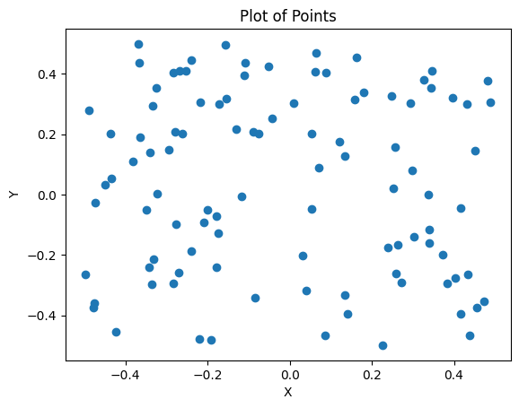

# Computational Geometry | Assignment 4: Convex Hulls

- Nicolas Bissig
- Antonino Grasso

## Quick Overview

Quick summary: We generate random point sets and compute their convex hulls using qhull. Compare the Timing (s)s for computing the convex hulls as the dimension and the set of points increases and draw parallels of qhull's operations to the lecture.

Resources:
- rbox: http://www.qhull.org/html/rbox.html

## How it works

Example Output for `rbox 100 D2 | qconvex s`:

The points plotted created by `rbox 100 D2` which `qconvex` tries to find a convex hull for:

What we see:

- Qhull found 15 points composing 15 lines (facets) representing the convex hull
- Qhull generated 28 hyperplanes (lines) between points that represent the *divide and conquer* approach of the algorithm
- With these these hyperplanes, the point in polygon test is done with a max distance point from that line, as points inside that spanning triangle must lie within the convex hull
- The number of max distance tests mentioned before are printed by Qhull aswell, in this case, 648 checks had to be performed

## Convex hull Timing (s)

General Overview:

All plots show a linear increase of distance tests and Timing (s) with increasing input size of either dimensions, points or both.

Qhull's complexity in average is considered to be $O\left( n \cdot log \left( n\right)  \right )$.

NOTE: tables have \``-`\` as mark when the qhull run for that configuration took way too long that we had to abort.

### Random points in the unit cube centered at the origin

Command: `rbox X DY | qconvex s` with `X` as the amount of points and `Y` as number of dimensions

Results:

|Dimension (Y)|Points (X)|Timing (s)|Distance tests for qhull|
|---|---|---|---|
|2|10|0|51|
|2|100|0|648|
|2|1000|0|6596|
|2|10000|0.001|65961|
|2|100000|0.008|657162|
|2|1000000|0.078|6440706|
|2|10000000|0.774|62312449|
|3|10|0|53|
|3|100|0|1163|
|3|1000|0|12879|
|3|10000|0.003|126745|
|3|100000|0.017|1237314|
|3|1000000|0.178|11157377|
|3|10000000|1.566|114508002|
|4|10|0|65|
|4|100|0|3397|
|4|1000|0.002|38085|
|4|10000|0.009|348774|
|4|100000|0.051|3428341|
|4|1000000|1.035|69925223|
|4|10000000|4.749|307025045|
|5|10|0|53|
|5|100|0.002|9625|
|5|1000|0.02|29540|
|5|10000|0.105|1843925|
|5|100000|0.594|18674730|
|5|1000000|2.773|145567204|
|5|10000000|19.32|1304318064|
|6|10|0|55|
|6|100|0.012|26535|
|6|1000|0.253|777957|
|6|10000|2.568|13657558|
|6|100000|13.01|143585900|
|6|1000000|61.89|1260616291|
|6|10000000|-|-|
|7|10|0|23|
|7|100|0.061|90129|
|7|1000|3.135|3509740|
|7|10000|44.31|83924183|
|7|100000|352.3|1197007369|
|7|1000000|-|-|
|7|10000000|-|-|
|8|10|0|9|
|8|100|0.266|289174|
|8|1000|36.48|18205216|
|8|10000|-|-|
|8|100000|-|-|
|8|1000000|-|-|
|8|10000000|-|-|

## Random points along a spiral in 3D

Command: `rbox l X | qconvex s` with `X` as the amount of points

Results:

|Points (X)|Timing (s)|Distance tests for qhull|
|---|---|---|
|10|0|39|
|100|0|1168|
|1000|0.001|17049|
|10000|0.014|222074|
|100000|0.151|2715508|

## Random points on a 4D sphere

Command: `rbox X s D4 | qconvex s` with `X` as the amount of points

Results:

|Points (X)|Timing (s)|Distance tests for qhull|
|---|---|---|
|10|0|75|
|100|0.001|4090|
|1000|0.01|65991|
|10000|0.129|878388|
|100000|1.612|10602719|
|1000000|19.11|121227723|

